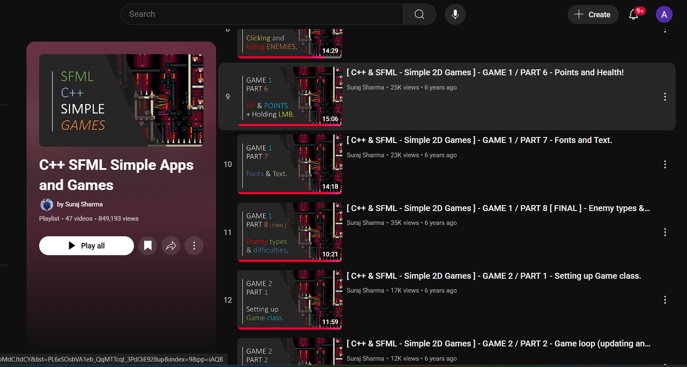

# 2D Retro Car Game

Welcome to the documentation for the **Endless Car Highway**, a simple SFML-based project that is inspired by the mobile classic from Nokia.

---

## ⚙️ Setting Up the Project (Visual Studio + SFML)

Follow these steps to build and run the simulator on **Windows**:

1. Install **Visual Studio 2022** (with C++ Desktop Development tools).  
2. Download and install **SFML 2.6+**.  
3. In your Visual Studio project:
   - Add SFML include and library paths (`Include` and `Lib` folders).
   - Link the required SFML libraries:  
     `sfml-graphics`, `sfml-window`, `sfml-system`.
4. Copy the SFML `bin` DLLs to your project’s executable directory.
5. Build and run the project.

For a visual setup guide, watch this tutorial:  

---

## 💡 What is SFML?

**SFML (Simple and Fast Multimedia Library)** is a C++ library for graphics, audio, and input handling.  
It allows developers to easily create 2D visualizations, games, and interactive tools.

This project uses SFML to render esmooth gameplay of a 2D, 4 lane Car game.

---

## 📝 Learning Phase

For someone who had worked almost entirely in console before, there was much catching up to do. Aside from the basic creating a window, there was much more to learn such as:
- creating sprites
- tracking mouse/keyboard input
- handling collisions
- screen transitions

And much more!

Thankfully a YouTube playlist did make my journey smoother and easy to understand by explaining these concepts with proper code. Although I did only watch GAME 1 (videos 1 to 12), the rest of the playlist is just as enlightening if not more and can help to create even more diverse types of game swith SFML.

## 🧩 Project Idea and Code Overview

The project demonstrates how a basic game works from new game to pause menu to stting difficulty and even seeing high scores!

### Core Functionality
- The user starts at the main menu.
- The choices are:
  - New Game: Start a new game. 
  - High Scores: See top scores.
  - Options: Set difficulty from easy, medium, hard.
  - Controls: Help menu showcasing controls.

### Main Components
- **main.cpp:** Runs the Game loop until user escapes or closes the window  
- **support.h / support.cpp:** Renders all the game screens, player car movement, spawning opposing cars, updating high scores, changing difficulty, etc.

---

## 🧪 Demo Implementation

Here’s a couple of videos of the running game:

<video controls width="100%">
  <source src="assets/vid0.mp4" type="video/mp4">
  Sorry, your browser doesn't support embedded videos.
</video>
<video controls width="100%">
  <source src="assets/vid1.mp4" type="video/mp4">
  Sorry, your browser doesn't support embedded videos.
</video>
This demo shows the real-time gameplay.

---

## 🚀 Running the Executable

1. Download the **ZIP** file (same name as repository) from the project’s main directory.  
2. Extract it into any folder.  
3. Run the exe file:

*(Currently supports Windows only.)*

No installation or configuration needed — everything is self-contained.

---

## 📘 Concepts Learned & Future Scope

### Concepts Learned
- Working with **SFML graphics** and event handling  
- Structuring **C++ OOP code** for creating classes of cars/trucks/vans.  
- Implementing real-time **dynamic gameplay** and points and difficulty system. 
- Debugging for out of bounds and wrong indexing errors and fixing them for smooth operations.  

### Future Scope
- 🧱 Improved UI  
- 🐧 Cross-platform builds (Linux / macOS)  
- ⚡ Support for more gameplay mechanics (invincibility token, more opposing vehicles,etc)  
- 💾 Option to save and load savestates (Continue option).

---

## 🧭 Credits

Developed by **Once-1296**  
Licensed under the [MIT License](LICENSE.md)

---

*This documentation site is built with [MkDocs Material](https://squidfunk.github.io/mkdocs-material/), featuring dark/light mode, navigation sidebar, and full-text search.*
